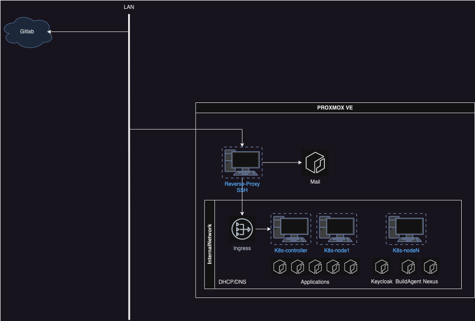

# Proxmox VE + K8s

Для начала опишем задачу:

1. Необходимо развернуть виртуальное окружение на выбранной локальной машине (или в облаке)
2. Внутри создать кластер K8s (K3s) для разворачивания приложений
3. Отдельно поднять Keycloak (или другой OpenIdConnect провайдер) для OAuth с БД (например Postgres)
4. Отдельно понять виртуальную машину для агентов сборки (например Gitlab)
5. Развернуть Nexus для артефактов сборок проектов и так же для пакетов (nuget)
6. Отдельно развернуть Mail Server для проксирования почты на нужные почтовые адреса

Для хранения кода легче использовать общедоступные Git провайдеры

- GitLab
- GitHub
- GitFlic

Потому что поднятие своего решения (self-hosted) не совсем рационально, при наличии ограниченных ресурсов. Если же у вас есть несколько физических машин, или даже большой сервер, то можно и поднять провайдер локально.

Все машины кластера Kubernates должны находится во внутренней сети с доступом во внешнюю. Доступ до приложений должен быть через Reverse-Proxy который смотрит и во внешнюю и во внутреннюю сеть.

Всем машинам во внутренней сети должен задаваться автоматически IP, обращение к ним осуществляется по их hostname – то есть помимо DHCP должен быть DNS сервер.

Сервер email сообщений выделен в отдельную виртуальную (или физическую) машину. Так как он логически не вяжется с K8s приложениями.
Kubernates кластер можно продублировать для создания новой среды (допустим PROD) и так же выделать под него отдельную InternalNetwork в которой будут свои Nexus, Keycloak, и т.д.

Маршрутизация внутри InternalNetwork осуществляется по средствам DNS. Каждой ноде (node) присваивается уникальный Hostname. Чтобы обратиться к конкретной ноде нужно перейти на {node1}.k8s.internal (учитывая что домен InternalNetwork это k8s.internal).

Давайте пойдем по шагам:

1. [Установка Proxmox](./proxmox-install.md)
2. [Настройка Proxmox](./proxmox-configurate.md)
