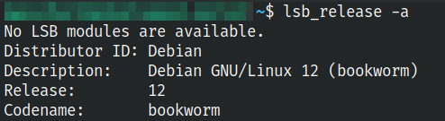

# Установка и настройка сервера по шагам

Сервер будет организован на ОС Debian 12 "Bookworm"



Конфигурация машины указана в файле [readme](./README.md#параметры-сервера)

## Установка операционной системы

Установка классическая, для начала загружаем образ системы с [официального сайта](https://www.debian.org/download)

Дальше нам нужно создать загрузочную флешку, для этого можно воспользоваться утилитой [Balena Etcher](https://etcher.balena.io/).

Если же вы создаете загрузочную флешку в Linux системе, то можно ничего не скачивать дополнительно, а воспользоваться встроенной утилитой `dd` через команду

```bash
# Чтобы найти путь до флешки используется команда
sudo fdisk -l

sudo dd if=<путь до образа iso> of=<путь до флешки например /dev/sda>
```

Дополнительную информацию о команде dd можно найти [тут](https://losst.pro/komanda-dd-linux) и [тут](https://habr.com/ru/articles/117050/)

После подготовки флешки, установка достаточно стандартная

- Вставляем флешку в целевую машину
- в настройках BIOS в BOOT меню выбираем флешку как приоритетный диск для запуска (в некоторых BIOS нужно переключиться в Legacy mode вместе UEFI иначе загрузочная флешка будет игнорироваться)
- Загружается окно установки ОС, выбираем язык, выбираем регион, пароли по умолчанию

Дальше переходим к этапу разметки диска. Нам предлагается использовать разметку LVM для удобной возможности изменения разделов, и легкого дополнения дополнительных дисков в уже созданный раздел. Выбираем ее, потому что нам может понадобится в процессе работы сервера расширять диск, и тогда нам не придется делать переразметку дисков. Помимо просто LVM предлагается дополнить диск шифрованием. Функция шифрования удобна если используется диск в ноутбуке, и есть страх его утери. При каждом запуске системы будет предложено ввести пароль для шифрованного диска. Но для домашнего сервера эта функция не удобна, потому что при каждом перезапуске сервера придется подключать его к монитору, чтобы разблокировать жесткий диск.

Дальше предлагается создать разделы. Разметка разделов зависит от доступной памяти на сервере. У нас установлен SSD на 512Gb поэтому разметка выглядит следующим образом

| Точка монтирования | Объем памяти | Назначение                                                                                               |
| ------------------ | ------------ | -------------------------------------------------------------------------------------------------------- |
| /boot              | 506M         | Раздел в котором содержится загрузчик ОС                                                                 |
| /                  | 90G          | Корневой раздел, тут будут устанавливаться приложения, утилиты, системные настройки                      |
| /var               | 18G          | Раздел с переменными файлами (Журналы ОС, кеш системы)                                                   |
| /tmp               | 2,6G         | Раздел с временными файлами                                                                              |
| /storage           | 185G         | Отдельно создавался раздел под persistent volume k3s сервера. Этот раздел будет монтироваться в Longhorn |
| /home              | 166G         | Домашний раздел, тут будут располагаться пользовательские настройки, пользовательские утилиты            |

>Для того, чтобы в процессе дальнейшей работы можно было управлять разделами LVM нужно установить утилиту `lvm2`
>
>```bash
>sudo apt install lvm2 # Может быть эта программа уже будет установлена
>```
>
>И в дальнейшем можно управлять разделами. В [этой](https://www.dmosk.ru/instruktions.php?object=lvm) статье описано что можно делать с помощью утилиты lvm

На последних этапах установки будет предложено поставить дополнительные программы, типа окружения рабочего стола и тд. Но нам окружение не нужно, а что стоит поставить:

- веб сервер
- ssh сервер

После этого система доставит указанные программы и предложит изъять установочный диск, чтобы перезагрузиться в готовую систему.

## Первоначальная настройка системы

После загрузки системы сервер уже можно отключать от монитора и подключаться к нему по SSH.

Дальше можно уже настраивать наш сервер

### Удаление лишних источников пакетов

В списке источников по умолчанию присутствует cd диск с системой, он нам будет мешать установке других пакетов. Будет постоянно просить вставить диск в дисковод.

Для того чтобы удалить данный источник откроем файл со списком в любом удобном редакторе. Самый простой способ открыть его в `nano`, потому что он точно будет установлен и доступен.

```bash
nano /etc/apt/sources.list
```

далее удаляем из файла следующую строку

```text
deb cdrom:[Debian GNU/Linux 12.1.0 _Bookworm_ - Official amd64 DVD Binary-1 with firmware 20230722-10:49]/ bookworm main non-free-firmware
```

### Установка sudo

В базовой сборке Debian отсутствует даже команда sudo, ее нужно ставить отдельно.

Для этого нужно переключиться под `root` пользователя командой `su` и выполнить следующие команды:

```bash
su -
apt install sudo
usermod -aG sudo <имя_пользователя>
```

теперь можно выйти из режима суперпользователя и пользоваться командой `sudo`

Больше информации можно найти [тут](https://losst.pro/ustanovka-sudo-v-debian-10)

### Установка zsh

Никто не спорит, что bash является культовой консольной оболочкой, но есть достойная альтернатива - zsh. Она имеет очень много плагинов, тем и расширений. Поэтому ее ценят за гибкость настройки и кастомизации.

Рассмотрим установку и настройку.

Установить ее можно из любого пакетного менеджера

```bash
sudo apt install zsh
```

Дальше нужно будет ее настроить, поэтому вызываем команду

```bash
zsh
```

На консоль выведется раздел настройки оболочки. В этой [статье](https://losst.pro/nastrojka-zsh-i-oh-my-zsh) есть более дельное описание, что означает каждая настройка.

Чтобы сделать `zsh` оболочкой по умолчанию, нужно выполнить команду

```bash
chsh -s $(which zsh)
```

Так же как и в bash, в zsh есть возможность настройки цветовой гаммы оболочки. Можно под каждого пользователя выбирать схему оформления, но если не хочется заморачиваться, то есть отдельный плагин, который называется `oh-my-zsh`

Чтобы его настроить нужно скачать установочный `sh` файл

```bash
curl -L https://raw.github.com/robbyrussell/oh-my-zsh/master/tools/install.sh | sh
```

Для установки нам понадобится несколько программ, которые могут отсутствовать на чистом Debian

```bash
sudo apt install git curl
```

#### Темы и плагины oh-my-zsh

Одной из лучших тем [считается **Powerlevel10k**](https://github.com/romkatv/powerlevel10k), чтобы ее установить в oh-my-zsh нужно выполнить:

```bash
git clone --depth=1 https://github.com/romkatv/powerlevel10k.git ${ZSH_CUSTOM:-$HOME/.oh-my-zsh/custom}/themes/powerlevel10k
```

И в файле `~/.zshrc` нужно заменить секцию `ZSH_THEME` на `ZSH_THEME="powerlevel10k/powerlevel10k"`

При последующем входе появится окно настройки.

установка sudo

установка openvpn
su -
apt install openvpn
cp ./<path-to-ovpn-file> /etc/openvpn/client.conf
systemctl enable openvpn
systemctl start openvpn
ip a show
